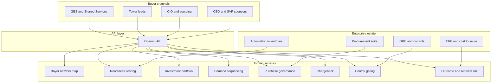

# Operum

**Source:** `ai-in-enterprise/Accenture-Intelligent-Operations-Survey-Demographics/`
**Domain:** `ai-enterprise`
**One-liner:** An intelligent-operations readiness and investment portfolio for large-enterprise buyers who already own technology-and-services purchasing power but struggle to convert functional ambition into governed, multi-tower automation programs.
**Wedge:** Shared Services / Operations, IT, Finance & Accounting, and Supply Chain leaders at companies with **$3B–$10B+** revenue who sit on intelligent-operations buying panels across NA, EALA, and APAC.
**Positioning:** A buy-side operating-model product for intelligent operations. The source is a demographics cut of a 460-respondent HfS–Accenture survey of people involved in buying decisions for technology and services — Operum turns that buyer profile into a system that closes the gap between “we want intelligent ops” and a sequenced, cross-functional investment plan with measurable tower outcomes.

## Market research synthesis

### Thesis from source

The source document is a survey demographics pack for *The Future Belongs to Intelligent Operations* (HfS Research and Accenture, 2017): **460 enterprise respondents** involved in buying decisions related to technology and services, interviewed in **Q3 2017** by telephone and online survey with follow-up depth questions, across **12 countries**. Industry coverage is broad (retail, healthcare, oil & gas, banking, insurance, utilities, consumer goods, life sciences, energy, high tech, telecom, software & platform, chemicals). Geography is intentionally multi-region: **US (130)** dominates North America alongside Canada (30); EALA includes UK, Germany, France, Italy, Spain, Brazil (30 each); APAC includes Australia, Japan, Singapore, China (30 each).

Functional concentration reveals the true buyer map for intelligent operations: Shared Services/Operations (**119**), IT (**100**), Finance & Accounting (**98**), CEO-adjacent and senior titles (CEO **78**, Senior VP / VP / Director bands totaling a large share of the 460), with meaningful representation from Supply Chain/Logistics (**45**), Marketing (**41**), Sales (**39**), HR (**39**), Procurement (**35**), and Customer Care (**34**). Revenue skew is unmistakable: **70%** of respondents sit at firms between **$3B and $10B (322)** or **greater than $10B (138)** — only **17%** below $10B in the <$10Bn band framing, with the $3–10B cohort alone at **~70%** of the sample when reading the labeled counts. Job-title mix shows buying happens below the C-suite as often as at it (Director **163**, VP **100**, Senior VP **56**, CEO **78**).

The product implication is not another automation bot catalog. The survey population is a **cross-tower economic buyer network** already authorised to purchase technology and services, spread across industries and regions, concentrated in shared services, IT, and finance at scale enterprises. The adoption gap to close is portfolio coherence: intelligent operations investments fragment by tower (IT buys RPA, Finance buys invoice AI, Supply Chain buys planning tools) without a shared readiness score, demand queue, or outcome attribution that a multi-country, multi-function buying cohort can defend to the CEO.

### Buyer & economic model

- **Primary buyer:** Head of Shared Services / Global Business Services, CIO/COO tandem, or Transformation Office owning intelligent-operations spend.
- **Users:** tower leads (Finance, HR, Procurement, Supply Chain, Customer Care), IT sourcing and architecture, vendor management, finance controllers measuring run-cost takeout, CEO/SVP sponsors reviewing portfolio health.
- **Budget owner / value metric:** technology-and-services budget for operations modernisation; value metric is **cost-to-serve reduction and cycle-time improvement per tower**, plus % of intelligent-ops spend under a single governed portfolio versus shadow tower purchases.
- **Competing status quo:** siloed RFP cycles per function, consultancy slide assessments with no living readiness score, vendor scorecards that ignore cross-tower dependency, and “intelligent automation” centers that count bots deployed rather than buyer-aligned outcomes.

### Domain constraints

- **Regulatory / trust / safety:** finance, HR, and customer-care automations touch regulated data and control environments; buying decisions must leave an audit trail of risk acceptance.
- **Data sensitivity:** readiness and maturity scores by tower are politically sensitive; vendor commercial terms must be permissioned.
- **Change-management realities:** 12-country operating footprints mean readiness is never uniform; Director/VP buyers need local evidence while CEO sponsors need portfolio rollups; shared-services economics punish duplicate tooling across towers.

## Business requirements

- BR-1: The platform must maintain a living intelligent-operations readiness score by functional tower and region, refreshable at least quarterly, aligned to the survey’s buyer map (Shared Services, IT, Finance, Supply Chain, etc.).
- BR-2: All intelligent-operations technology and services investments above a configurable threshold must register in a single portfolio before purchase approval, reducing shadow tower buying.
- BR-3: Portfolio items must declare primary tower, dependent towers, target cost-to-serve or cycle-time KPI, and buying role (economic buyer vs influencer), mirroring the survey’s multi-title buying reality.
- BR-4: Readiness gaps must generate a sequenced demand queue (stabilize → automate → intelligently decide) rather than a flat wish list.
- BR-5: Cross-country programs must support regional readiness variance without losing enterprise rollup for CEO/SVP sponsors.
- BR-6: Vendor and services engagements must link to portfolio outcomes; renewals without linked KPI movement require explicit exception approval.
- BR-7: Shared-services chargeback or allocation views must show which towers fund which capabilities, exposing free-rider and duplicate-spend patterns.
- BR-8: Risk and control owners must be able to block go-live on automations lacking documented control mapping in Finance, HR, or Customer Care.
- BR-9: The system must report % of intelligent-ops spend under portfolio governance versus estimated out-of-band purchases.
- BR-10: Exception path: when a tower purchases outside the portfolio, the event is logged, scored as leakage, and requires remediation plan within a time box.
- BR-11: Board/CEO packs must export demographics-style coverage (tower, region, revenue band peer context) so sponsors see whether the program matches the enterprise’s actual buying footprint.
- BR-12: Commercial constraint: portfolio prioritisation must prefer initiatives with dual-tower benefit (e.g., Procurement + Finance AP) over single-tower vanity automation.

## User stories

Canonical user stories live in sibling [USER_STORIES.md](USER_STORIES.md).

## System design

### Overview

Operum captures the enterprise’s intelligent-operations buyer network, scores tower/region readiness, and governs the investment portfolio of technology and services buys. Demand enters as use cases with KPI targets; sequencing respects readiness; purchasing events either attach to the portfolio or are flagged as leakage; outcomes feed renewal and chargeback decisions. It is deliberately a **buy-side and operating-model** system, not an RPA runtime.

### Actors & boundaries

- **Actors:** GBS/Shared Services lead, tower leads, CIO/sourcing, CEO/SVP sponsor, risk/control, portfolio admin, vendors (via integration, not as primary users).
- **Trust boundary:** commercial terms and readiness politics stay inside the enterprise boundary; vendor systems receive only scoped RFX artifacts. Operational systems of record (ERP, HRIS, WMS) remain authoritative for transactions.
- **Human-in-the-loop points:** portfolio admission, exception approval for renewals without KPI movement, go-live risk blocks, leakage remediation acceptance.

### Core capabilities

1. **Buyer network map** — titles, towers, regions matching the survey footprint.
2. **Readiness scoring** — tower × region living scores and gap narratives.
3. **Investment portfolio** — technology and services initiatives with KPI contracts.
4. **Demand sequencing** — readiness-aware queue and dual-tower preference.
5. **Purchase governance** — in-portfolio vs leakage detection.
6. **Chargeback and funding** — tower economics for shared capabilities.
7. **Control gating** — risk blocks for Finance/HR/Customer Care automations.
8. **Outcome and renewal link** — KPI movement bound to vendor engagements.
9. **Executive coverage reporting** — demographics-style rollups for sponsors.

### Conceptual data

- **Primary entities:** Organization, Tower, Region, BuyerPersona, ReadinessAssessment, PortfolioInitiative, DemandItem, VendorEngagement, PurchaseEvent, LeakageCase, ChargebackAllocation, ControlMapping, OutcomeKPI, ExecutiveCoverageReport.
- **Critical events:** readiness refreshed, initiative admitted, purchase recorded, leakage opened, go-live blocked, renewal exception raised, chargeback posted, coverage report published.
- **Retention / audit needs:** purchase and exception history retained for vendor audit and SOX lookback; readiness snapshots versioned quarterly.

### Integrations (conceptual)

- **Systems of record:** ERP and shared-services finance (cost-to-serve), procurement/sourcing suites, ITSM and automation CoE inventories, HRIS, risk/GRC tools.
- **Upstream signals:** bot/automation runtime counts (as weak signals), ticket volumes, cycle-time metrics from process mining, vendor invoice feeds.
- **Downstream actions:** RFX packages, purchase approvals, chargeback journals, board packs, remediation workflows.

### High-level architecture

### Success metrics

- **Leading:** % of intelligent-ops spend in-portfolio; readiness refresh currency; dual-tower initiative share; leakage case closure time; control-gate pass rate.
- **Lagging:** cost-to-serve and cycle-time improvement by tower; renewal rate conditional on KPI movement; reduction in duplicate tooling across Shared Services/IT/Finance; sponsor coverage completeness versus the survey’s multi-region, multi-tower buying pattern.

## OpenAPI skeleton

Canonical HTTP surface lives in sibling [openapi.yaml](openapi.yaml). Summary:

- **Base path:** `/v1/...`
- **Auth:** `X-API-Key` for ERP/procurement integrations; Bearer JWT for operators.
- **Resource groups:** Network, Readiness, Portfolio, Purchases, Controls, Outcomes, Reporting.
