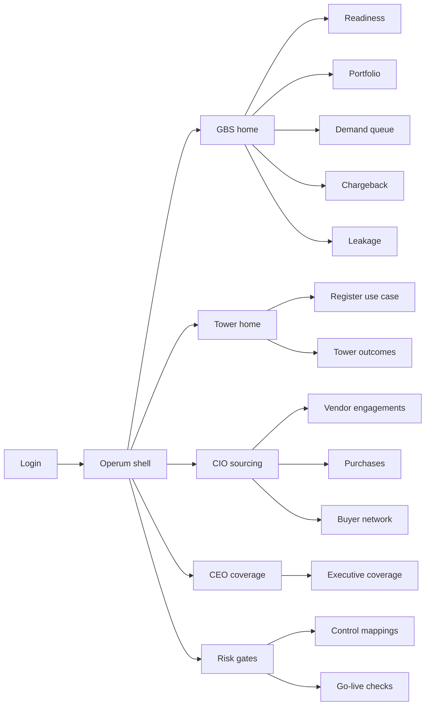
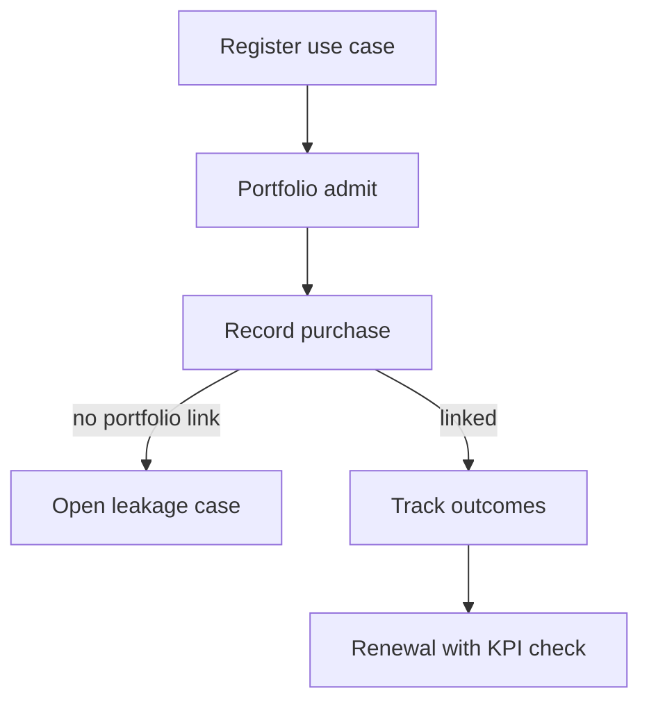

# Operum — Web app

**Product:** [PRODUCT.md](./PRODUCT.md)
**Primary surface:** GBS / Shared Services intelligent-operations portfolio console
**Secondary surfaces:** CEO/SVP coverage pack viewer (read-only rollup); risk go-live gate desk (control mapping)
**Design thesis:** Operum is a buy-side control tower for intelligent operations — the UI metaphor is a multi-tower airfield map (Shared Services, IT, Finance, Supply Chain, HR, Customer Care) where every technology-and-services purchase must land on a governed runway or be scored as leakage. Visual language is cold hangar concrete and signal-cyan for in-portfolio spend, with leakage amber and control-block coral. The brand wordmark sits on every readiness heatmap and purchase approval so tower VPs know this is portfolio coherence, not another bot count dashboard.

## UX research synthesis

### Category peers (best-in-class)

- **ServiceNow Strategic Portfolio Management / Demand:** Cross-function demand intake, funding views, and executive rollups. Steal: single portfolio before purchase approval; reject IT-project jargon where Operum speaks towers, cost-to-serve, and buying roles from the HfS–Accenture buyer map.
- **Coupa / SAP Ariba guided buying:** Threshold-based purchase governance and exception workflows. Steal: out-of-band purchase → leakage case with remediation deadline; reject catalog-shopping UX for intelligent-ops SOWs that need dual-tower dependency flags.
- **UiPath Automation Hub / Blue Prism Hub:** Automation opportunity pipelines with benefit estimates. Steal: sequenced demand (stabilize → automate → intelligently decide); reject bot-deployed vanity KPIs as the home metric.
- **MetricStream / ServiceNow GRC:** Control mapping and go-live gates for regulated processes. Steal: Finance/HR/Customer Care automations cannot go live without documented controls; reject GRC density on the GBS home screen.

### Patterns to adopt / reject

- **Adopt:** Tower × region readiness heatmap; portfolio admission before PO; dual-tower preference in ranking; chargeback exposing free-riders; renewals tied to KPI movement; demographics-style coverage for CEO packs.
- **Reject:** RPA bot leaderboards as success; flat wish lists; purple “intelligent automation AI” marketing panels; editable historical leakage closures; single-tower vanity as default sort.

### Trust, density, and workflow constraints from PRODUCT.md

Readiness scores are politically sensitive across 12-country footprints (BR-5): role-gate tower detail while CEO sees rollups. Vendor commercial terms are permissioned. Finance/HR/Customer Care go-lives are control-gated (BR-8). Shadow buying must create timed leakage cases (BR-10). Density is portfolio-grade for GBS/CIO; tower leads get outcome-first registration forms, not enterprise heatmaps by default.

## Information architecture

### Nav model

### Roles → default home

| Role | Default home | Why |
|------|--------------|-----|
| Head of Shared Services / GBS | GBS home — in-portfolio % + readiness by tower | Portfolio coherence (BR-2, BR-9) |
| Tower lead (Finance, SC, HR, …) | Tower home — use cases and KPI contracts | Outcome-judged buys |
| CIO / IT sourcing | Purchases and vendor engagements | Renewals and buying network (BR-6) |
| CEO / SVP sponsor | Executive coverage | Multi-region rollup (BR-11) |
| Risk / control officer | Go-live checks | Block missing control maps (BR-8) |
| Portfolio administrator | Leakage queue | Shadow-buy remediation (BR-10) |

### Cross-links to OpenAPI resources

| Nav area | OpenAPI tags / resources |
|----------|---------------------------|
| Buyer network, towers | Network |
| Readiness assessments | Readiness |
| Initiatives, demand queue | Portfolio |
| Purchases, leakage | Purchases |
| Control mappings, go-live | Controls |
| KPI outcomes | Outcomes |
| Executive coverage, chargeback | Reporting |

## Screen inventory

### GBS home

- **Purpose:** Answer “is intelligent ops a governed enterprise program or twelve local tool buys?” in one composition.
- **Entry:** Post-login for GBS roles.
- **Layout regions:** Brand + org/region switcher; strip (% spend in-portfolio, readiness freshness, dual-tower initiative share, open leakage); tower readiness mini-map; portfolio pulse table; alerts (control blocks, renewal exceptions).
- **Primary actions:** Open portfolio; admit initiative; open leakage; export CEO pack.
- **Empty / loading / error:** Empty = import buyer network + first readiness cycle; loading = skeleton heatmap; error = retry with request id.
- **BR / story ties:** BR-1, BR-2, BR-9; GBS stories.

### Buyer network map

- **Purpose:** Mirror the survey’s multi-title buying reality — Director/VP influencers as well as CEO.
- **Entry:** CIO → Network; GBS settings.
- **Layout regions:** Persona table (title band, tower, region, economic buyer vs influencer); coverage gaps vs expected footprint; engagement history on buys.
- **Primary actions:** Add persona; tag role on initiative; export coverage gaps.
- **Empty / loading / error:** Empty = seed from HfS-style title bands; incomplete regions flagged.
- **BR / story ties:** BR-3, BR-11; CIO stories.

### Readiness by tower and region

- **Purpose:** Living readiness score, refreshable at least quarterly, with gap narratives.
- **Entry:** GBS → Readiness.
- **Layout regions:** Heatmap (tower × region); score trend; gap narrative panel; refresh workflow; stabilize/automate/decide readiness tags.
- **Primary actions:** Start assessment; publish quarterly snapshot; drill to country.
- **Empty / loading / error:** Stale &gt;90 days = amber currency banner; political sensitivity notice on drill-down.
- **BR / story ties:** BR-1, BR-5.

### Investment portfolio

- **Purpose:** Single register of technology and services investments above threshold before purchase approval.
- **Entry:** GBS → Portfolio; purchase deep link.
- **Layout regions:** Initiative table (primary tower, dependents, KPI contract, buying roles, stage); admit drawer; dual-tower benefit flag; dependency warnings.
- **Primary actions:** Admit; request purchase link; prefer dual-tower sort; archive.
- **Empty / loading / error:** Empty = register first Finance+Procurement pattern; validation requires KPI + towers.
- **BR / story ties:** BR-2, BR-3, BR-12.

### Demand sequencing queue

- **Purpose:** Turn readiness gaps into stabilize → automate → intelligently decide sequences — not a flat wish list.
- **Entry:** GBS → Demand; readiness gap CTA.
- **Layout regions:** Ordered queue with readiness gate; dual-tower boost; blocked items with reason; capacity notes.
- **Primary actions:** Reorder within policy; promote to portfolio; defer with note.
- **Empty / loading / error:** Empty = healthy readiness message; policy violation on illegal reorder.
- **BR / story ties:** BR-4, BR-12.

### Tower use-case registration

- **Purpose:** Let tower leads declare cost-to-serve or cycle-time targets and dependent towers before SOW.
- **Entry:** Tower home CTA.
- **Layout regions:** Form (KPI, primary/dependent towers, buyer roles); impact preview on IT/Procurement; draft → submit to portfolio.
- **Primary actions:** Save draft; submit; invite dependent tower owner.
- **Empty / loading / error:** Inline validation on missing dependents for known patterns.
- **BR / story ties:** BR-3; tower lead stories.

### Purchases and vendor engagements

- **Purpose:** Attach buys to portfolio outcomes; flag renewals without KPI movement.
- **Entry:** CIO home; Portfolio → Purchases.
- **Layout regions:** Purchase event list; vendor engagement cards linked to KPIs; renewal exception queue; RFX artifact links.
- **Primary actions:** Record purchase; raise renewal exception; approve exception with audit.
- **Empty / loading / error:** Orphan purchase (no portfolio) → auto-open leakage draft.
- **BR / story ties:** BR-6, BR-10.

### Leakage cases

- **Purpose:** Out-of-band tower purchases become scored leakage with time-boxed remediation.
- **Entry:** Alerts; Purchases; Admin → Leakage.
- **Layout regions:** Queue (deadline countdown); case detail (spend, tower, missing portfolio link); remediation plan; closure evidence.
- **Primary actions:** Assign remediation; extend with approval; close; score leakage.
- **Empty / loading / error:** Empty = “no shadow buys detected” with last scan time; overdue = coral.
- **BR / story ties:** BR-9, BR-10.

### Chargeback and funding

- **Purpose:** Show which towers fund which shared capabilities; expose free-riders and duplicates.
- **Entry:** GBS → Chargeback.
- **Layout regions:** Allocation matrix; free-rider highlights; duplicate tooling clusters; export to finance.
- **Primary actions:** Propose reallocation; export journal; open related initiatives.
- **Empty / loading / error:** Missing ERP feed = integration banner.
- **BR / story ties:** BR-7; GBS funding stories.

### Control mapping and go-live gate

- **Purpose:** Block Finance/HR/Customer Care automations lacking documented control mapping.
- **Entry:** Risk home; initiative go-live request.
- **Layout regions:** Mapping checklist; GRC link status; go-live check result; waiver path with audit.
- **Primary actions:** Submit mapping; run go-live check; block; approve waiver.
- **Empty / loading / error:** Fail = coral blocking banner with control gaps.
- **BR / story ties:** BR-8; risk stories.

### Outcomes and renewal link

- **Purpose:** Prove cost-to-serve / cycle-time movement bound to vendor engagements.
- **Entry:** Tower outcomes; CIO renewals.
- **Layout regions:** KPI trend vs contract; vendor link; exception when flat; portfolio attribution.
- **Primary actions:** Refresh outcomes; flag renewal hold; export.
- **Empty / loading / error:** No baseline = cannot score renewal.
- **BR / story ties:** BR-6; tower/CIO stories.

### Executive coverage pack

- **Purpose:** Demographics-style tower × region coverage for CEO/SVP sponsors.
- **Entry:** Sponsor login; GBS export.
- **Layout regions:** Coverage grid; in-portfolio spend rollup; readiness rollup; peer revenue-band context note; PDF/CSV export.
- **Primary actions:** Publish pack; schedule quarterly.
- **Empty / loading / error:** Incomplete region = gap callouts, not silent zeros.
- **BR / story ties:** BR-5, BR-11.

## Key flows

1. **Admit and buy in-portfolio** — register use case → portfolio admit → purchase attaches → outcomes feed; failure: orphan purchase opens leakage.

2. **Readiness-aware sequencing** — quarterly assess → gaps → demand queue stabilize/automate/decide → dual-tower boost → promote to portfolio.

3. **Control-gated go-live** — initiative ready → control mapping → go-live check → pass/block/waiver; failure: coral block for Finance/HR/Care.

4. **Leakage remediation** — detect out-of-band buy → time box → remediation plan → close or escalate; failure: overdue scored against tower.

5. **Renewal exception** — vendor renewal due → KPI flat → exception required → approve with audit or terminate path.

## Design system

### Tokens (CSS variables)

- `--color-ink: #E7EEF2` — text on dark ground
- `--color-concrete-950: #101418` — app ground
- `--color-concrete-900: #1A2228` — panels
- `--color-concrete-700: #3A4650` — rules
- `--color-cyan: #3DB8C5` — in-portfolio / readiness healthy
- `--color-cyan-dim: #1F6A72` — cyan on dark
- `--color-amber: #D4A017` — leakage / stale readiness
- `--color-coral: #D94F45` — control block / overdue leakage
- `--color-steel: #8A9AA6` — secondary labels
- `--color-brand: #8EC9D0` — Operum wordmark (hangar cyan)
- `--font-display: "IBM Plex Sans", sans-serif`
- `--font-mono: "IBM Plex Mono", monospace` — purchase ids, leakage ids
- `--space-1`…`--space-8`: 4px scale
- `--radius-sm: 4px`; `--radius-md: 8px`
- `--motion-land: 180ms ease-out` — purchase lands in portfolio
- `--motion-leak: 260ms ease-in-out` — leakage amber pulse
- Atmosphere: faint blueprint grid on concrete-900; soft industrial vignette; no stock “robots in warehouse” heroes.

### Typography & brand

- Display for readiness scores and in-portfolio %; mono for PO ids and leakage case ids.
- Brand on every purchase approval and heatmap; login hero: “Land every ops buy on one runway”; one CTA.

### Do / don’t

- **Do:** Require portfolio before purchase; show dual-tower preference; time-box leakage; block go-live without controls; demographics coverage for sponsors.
- **Don’t:** Bot-count home; purple automation glow; flat wish lists; card spam of vendor logos; emoji tower status.

### Accessibility & domain trust cues

- AA+ contrast; leakage/control states use icon + text.
- Live regions for go-live blocks and leakage deadlines.
- Focus: readiness → demand → portfolio → purchase → outcome.
- CEO pack exports structured coverage for audit.

## Component patterns

- **TowerRegionHeatmap** — living readiness grid with freshness badge.
- **PortfolioAdmitDrawer** — KPI + dependent towers + buying roles.
- **DemandSequenceRail** — stabilize → automate → decide.
- **LeakageCaseRow** — countdown + remediation status.
- **ChargebackMatrix** — tower funding with free-rider highlight.
- **GoLiveGateBanner** — coral control-block state.
- **BuyerPersonaChip** — economic buyer vs influencer.
- **ExecutiveCoverageGrid** — tower × region demographics pack.

## Out of scope for v1 web

- RPA/bot runtime orchestration; vendor marketplace storefront; full ERP AP; native mobile for GBS leaders; multi-enterprise consultancy white-label; employee-facing chatbot for HR automations.
